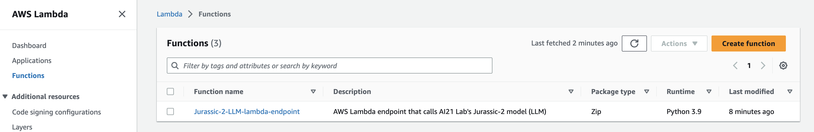
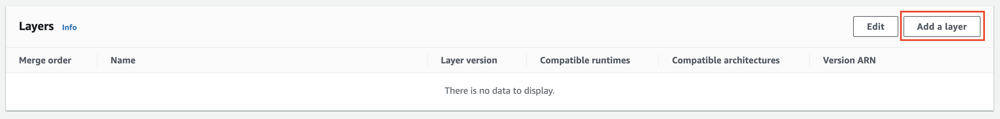
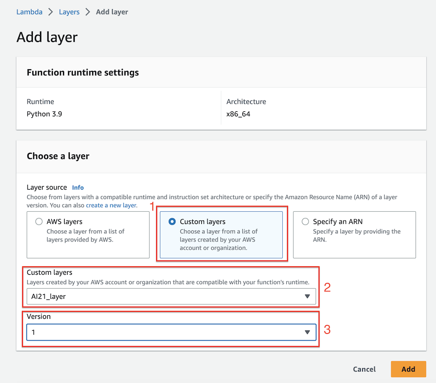
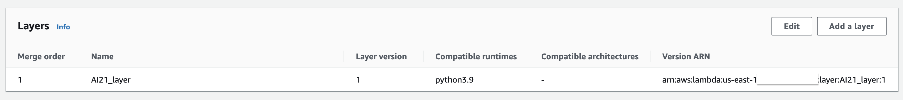

# Adding layer to lambda endpoint

This section will walk you through how to add the lambda layer to your lambda function that you created in the section [Deploying AWS Lambda layer](./docs/layer.md).

## Navigate to the AWS Lambda service

1. You first need to navigate to the AWS Lambda service in the AWS Console.

2. If needed search for the lambda function with the **function name** of **_Jurassic-2-LLM-lambda-endpoint_**. You should then see a screen similar to the one below.
3.  Next, click on the lambda function.

    

4. Once you have click on the function scroll to the very bottom of the page, and you will see the **Layers** section.

5. Now click the **Add a layer** button in the upper right-hand corner of the page.
    

## Select layer

You will then be presented with the screen you see below.

1. Select the **Custom layers** radio button.
2. In the **Customers layers** dropdown list select the **AI21_layer** or whatever you named your layer when creating it.
3. Then select version 1 in the **Version** dropdown list.
    - You can have multiple versions of your layer if you ever need to update it.
4. Click the **Add** button at the bottom of the screen.

   

## Verify layer was added

After you have successfully added the layer you will now see the layer added to the **Layers** section of the lambda function's **Code** tab. See an example below.

[Previous < Deploying CloudFormation template](./cfn.md) | [Next > Testing Endpoint](./test.md)
