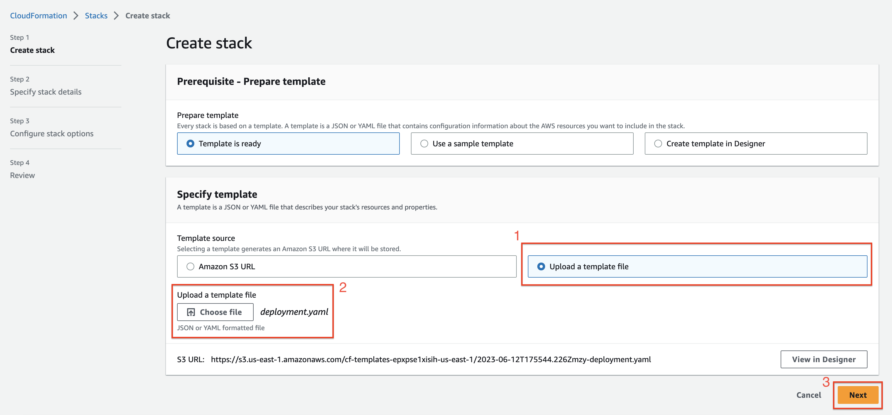

# Deploying CloudFormation template

This section will walk you through how to deploy the CloudFormation template for the solution. The CloudFormation template will spin up all the needed resources for you to run this solution in a demo environment.

## Navigate to the CloudFormation service

You will first navigate to the CloudFormation service in the AWS Console. Once you are there you will click the **Create stack** button and select the option displayed in the screenshot below.

## Create Stack

1. You will then be present with the following screen. You will select the options outlined in red in the screenshot below.

2. For step number two in the screenshot below, click **Choose file**, then navigate to where you have cloned the repository, and select the **./src/deployment.yaml** file .

3. Lastly, you will click the **Next** button to progress to the next step.

## Stack Details

1. On this screen you will give your stack a name. This can be any name that you would like.

2. The final step is to enter you AI21 Labs API key in the **Parameters** section.

You can create a free API key by following the steps below.

- [Sign up for a free account](https://www.ai21.com/studio/pricing)
- [Access your API key here](https://studio.ai21.com/account/api-key)

**Note:** If you would like to change your API key later you can navigate to the AWS Secrets Manager service to up your API key.

3.  You will then click the **Next** button.

## Configure Stack

On the **Configure Stack** screen you will leave all the default values, scroll to the bottom of the page and click **Next**.

## Review Stack

1. In this step you will see a screen similar to the one below  which will allow you to review the values before submitting the CloudFormation template.

2. After you have reviewed the stack configuration scroll to the bottom of the screen, and select the checkbox that you see in the screenshot below.

 3. Next click the **Submit** button to deploy the CloudFormation template.

## Stack deployed

After your CloudFormation template has been deployed successfully you will see a screen like the one below. The screen shows all of the AWS resources that were deployed as part of the CloudFormation template.

Now that you have successfully deployed the lambda endpoint and other AWS services that are needed, we will walk through how to add the **layer** to the lambda function that was deployed by the CloudFormation template.

[Previous < Deploying AWS Lambda layer](./layer.md) | [Next > Adding layer to lambda endpoint](./adding_layer.md)
