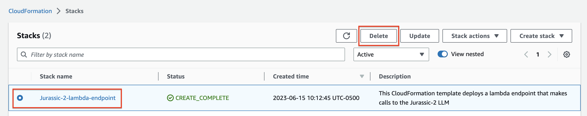
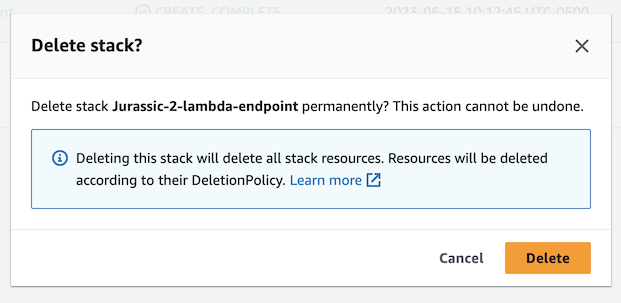
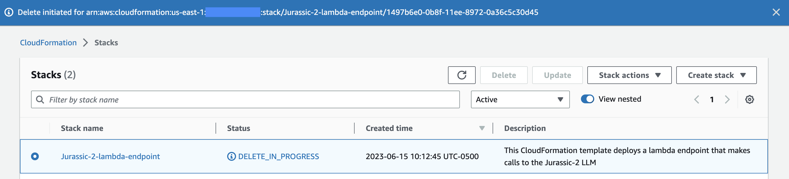

# Cleanup

This section will cover how to remove all the AWS resources that were created when we deployed the CloudFormation template.

## Navigate to CloudFomration

1. You will need to first navigate to the CloudFormation service and then select the **Stack name** that you deployed. In this example the name of our stack is **Jurassic-2-lambda-endpoint**. 

2. After selecting the radio button next to the stack you would like to delete you will click the **Delete** button.

    See screenshot below.

    

3. Once you click the Delete button you will be presented with the following screen. 

    

4. You will then click the **Delete** button to confirm that you would like to remove all the resources that the CloudFormation template created.

5. After you have confirmed that you would like to delete the CloudFormation stack you will see the screen below.

    

Once the deletion process is complete all AWS resources will have been removed from your AWS account, and the stack will no loner show up in your CloudFormation stack list.

[Previous < Testing lambda endpoint](./test.md) | [> Deployment Guide Home](../readme.md)
