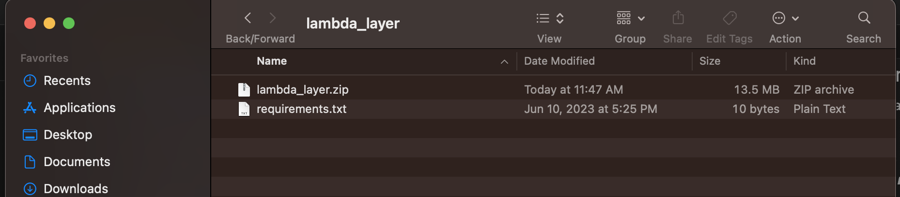
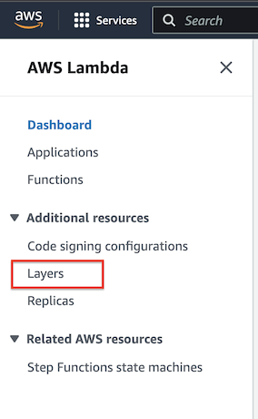
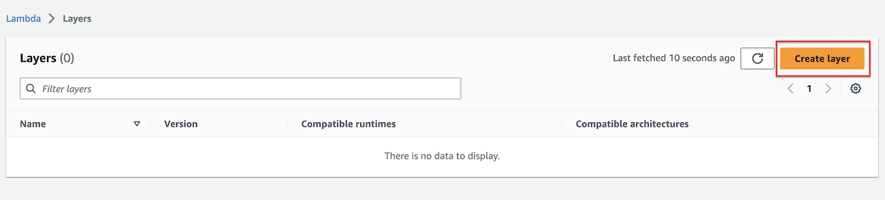
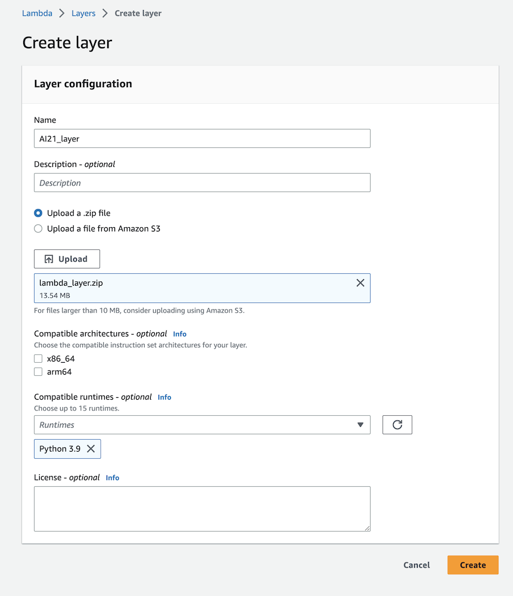
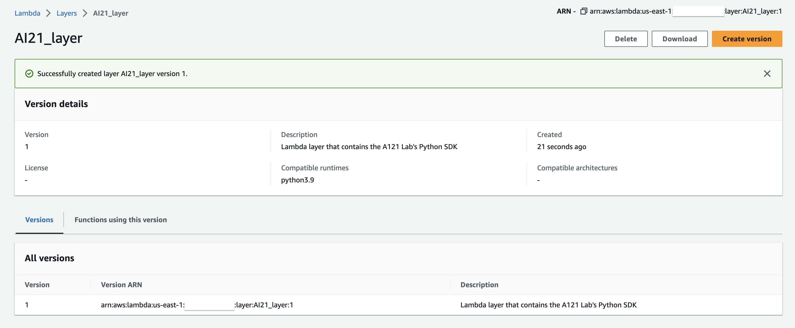

# Deploying AWS Lambda layer

This section we will walk you through all the steps needed to deploy the lambda layer needed for the lambda function to include  AI21 Lab's Python SDK library. This SDK is needed for the lambda function to communicate with the Jurassic-2 model.

The purpose of the lambda layer is to give your lambda function access to libraries and custom runtimes that are not part of the of the AWS Lambda service natively. If you are not familiar with what lambda layers are you can learn more [here](https://docs.aws.amazon.com/lambda/latest/dg/invocation-layers.html).

## Packaging the Lambda layer

This section will cover packaging up your lambda layer to upload to the AWS Lambda service.

1. This repo includes the _requirements.txt_ file in the following directory **_./lambda_layer > requirements.txt_** file with the names of the libraries that will be packaged with your lambda layer.

- Navigate to the **_./lambda_layer_** directory from your terminal.
- Next run the command below.

If you don't have **pip3** installed you can find instructions here [here](https://pip.pypa.io/en/stable/installation/)

```bash
pip3 install -r requirements.txt -t ./python/lib/python3.9/site-packages && zip -r lambda_layer.zip ./python && rm -R ./python
```

2. If you have followed all the steps correctly you should have a folder containing the zipped lambda layer similar to the image below.

    **Note:** The **lambda_layer.zip** contains our lambda layer.



## Creating the Lambda layer

1. To deploy the layer in your AWS account you will login and navigate to the AWS Lambda service.

2. Next you will navigate to the **_Layers_** section in the menu on the left. See image below.

    

3. You will then click the **Create layer** button in the upper right-hand corner. See image below.

    

4. On the next screen you will fill in the layer configuration info. See example below.

    

    For the **Upload** section you will navigate to the **_python.zip_** folder you created in the previous section.

5. Once you have fill out the needed info you will click the **Create** button, and should see a screen similar to the one below.

    

You have now successfully created the lambda layer that will be used by the lambda function that you will deploy in the next section.

[Previous < Deployment Guide](../readme.md) | [Next > Deploying CloudFormation template](./cfn.md)
