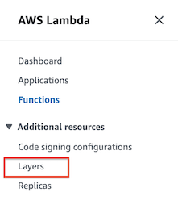

# Deploying AWS Lambda layer

This section we will walk you through all the steps needed to deploy the lambda layer needed for the lambda function to include AI21 Lab's Python SDK library. This SDK is needed for the lambda function to communicate with the Jurassic-2 model.

The purpose of the lambda layer is to give your lambda function access to libraries and custom runtimes that are not part of the of the AWS Lambda service natively. If you are not familiar with what lambda layers are you can learn more [here](https://docs.aws.amazon.com/lambda/latest/dg/invocation-layers.html).

Note: We will be using the AWS CloudShell to run all the commands needed to deploy your layer.

## Packaging the Lambda layer

This section will cover packaging up your lambda layer and uploading it to the AWS Lambda service.

1. Open the AWS CloudShell

    You can access the AWS CloudShell by clicking the terminal icon at the top of your AWS Console window. See image below for where you can find the CloudShell icon outlined in red.

    

2. Once your AWS CloudShell opens you should be a terminal window open at the bottom of the screen similar to the image below.

   

3. Next you will run the commands below

The CloudShell should have **pip3** already installed. If for some reason it is not installed you can find instructions [here](https://pip.pypa.io/en/stable/installation/) on how to install it.

## Package your lambda layer 👇

```bash
pip3 install -r requirements.txt -t ./python/lib/python3.9/site-packages && zip -r lambda_layer.zip ./python && rm -R ./python && ls
```

You should then see the **lambda_layer.zip** listed in the terminal window after the command has run successfully. Next you will run the command below to upload the lambda layer to your AWS account.

## Upload your lambda layer 👇

The command below may take a few seconds to execute.

```bash
aws lambda publish-layer-version --layer-name AI21_layer --zip-file fileb://lambda_layer.zip --compatible-runtimes python3.9
```

## Lambda layer

You can view your layer in the AWS Console by navigating to the AWS Lambda service, and then selecting **Layer** from the menu to the left. See image below.



You should then see a list showing your layer. See example below.


You have now successfully created the lambda layer that will be used by the lambda function that you will deploy in the next section.

[Previous < Deployment Guide](../readme.md) | [Next > Deploying CloudFormation template](./cfn.md)
