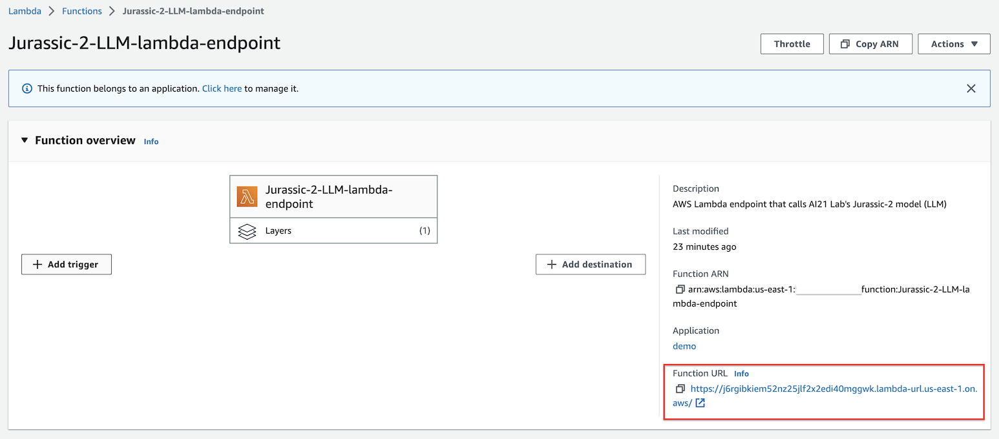
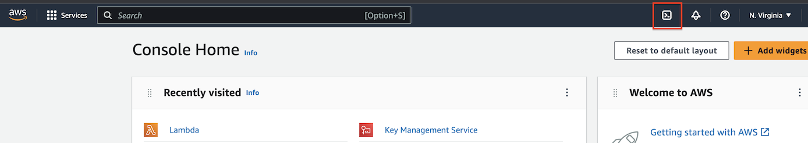
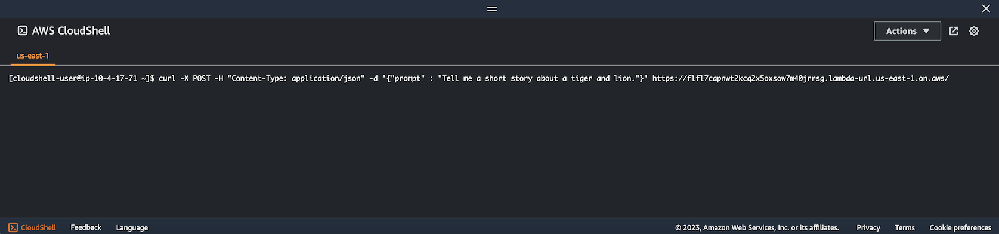
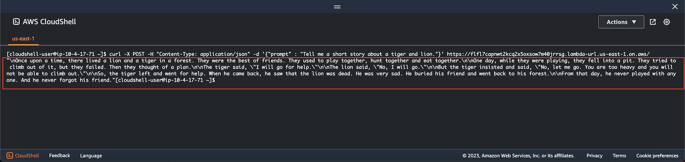

# Testing Lambda endpoint

This section will walk you through how to test the lambda endpoint which will return results from the Jurassic-2 model after calling it.

## Calling Lambda endpoint with **_curl_**

The following example demonstrates how to test your lambda endpoint using the curl command to call the endpoint that has been deployed and configured.

```bash
curl -X POST -H "Content-Type: application/json" -d '{"prompt" : "Tell me a short story about a tiger and lion."}' https://<your-lambda-endpoint-url>.lambda-url.us-east-1.on.aws/
```

Note: If you are on a Windows PC you can use the [AWS CloudShell](https://aws.amazon.com/cloudshell/) to run the commands.

### Finding your lambda endpoint URL

1. To obtain the endpoint URL -> go to the AWS Console -> navigate to the lambda service -> search for the **Jurassic-2-LLM-lambda-endpoint** lambda function and select it.

2. You should see a screen similar to the one below where you can find the **Function URL** outlined in red in the image.


## Sample output

Below is an example of calling the lambda endpoint from the AWS CloudShell.

1. You can access the AWS CloudShell by clicking the terminal icon at the top of your AWS Console window. See image below for where you can find the CloudShell icon outlined in red.



2. Once your AWS CloudShell opens you should be a terminal window open at the bottom of the screen similar to the image below.


### _Testing Lambda Endpoint from the AWS CloudShell_

Below is the curl command for testing the endpoint in the CloudShell.



### _Output from calling Lambda Endpoint_



The area outlined in red is the raw output returned from the lambda endpoint that calls the Jurassic-2 model.

Next we will walk through how to clean up the AWS resources that were deployed.

## Final Notes

The lambda endpoint/API that was deployed gives you the ability to add generative AI to web apps, mobiles and many other application types.

This solution should only be run in a test/demo environment in its current state, and is only meant show you the concepts to create an API endpoint that gives you generative AI capabilities.

You will need to add a layer of security to the endpoint before it should be used outside of a demo environment.

### API Security Considerations

Below are some of the things you should consider when deploying a production ready API endpoint.  

- Add an authentication and authorization mechanism (API keys, AWS IAM, OpenID, etc)
- Limit the domains that can call the API by using the CORS setting
- If the API endpoint is a private API used internally only, block external access (don't leave it open to the public internet).
- Use an edge protection solution such as a WAF to protect your API endpoint
- Ensure logging and monitoring is setup
- All API calls should communicate over HTTPS

[Previous < Adding layer to lambda endpoint](./adding_layer.md) | [Next > Cleanup](./cleanup.md)